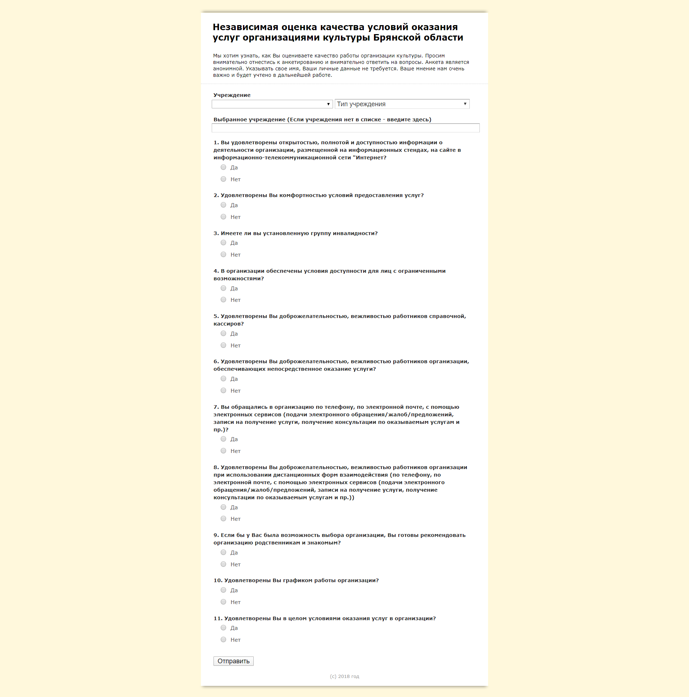

# Опросник для министерства культуры. (html-questionnaire-kultura32)

В рамках социального проекта был создан опросник для министерства культуры. 2017 год. Независимая оценка качества условий оказания услуг организациями культуры Брянской области. Собраны более 40000 ответов, и сделан подробный отчет.
Данные анонимного опроса импортируются в гугл форму.

https://kultura32.rane-brf.ru/

